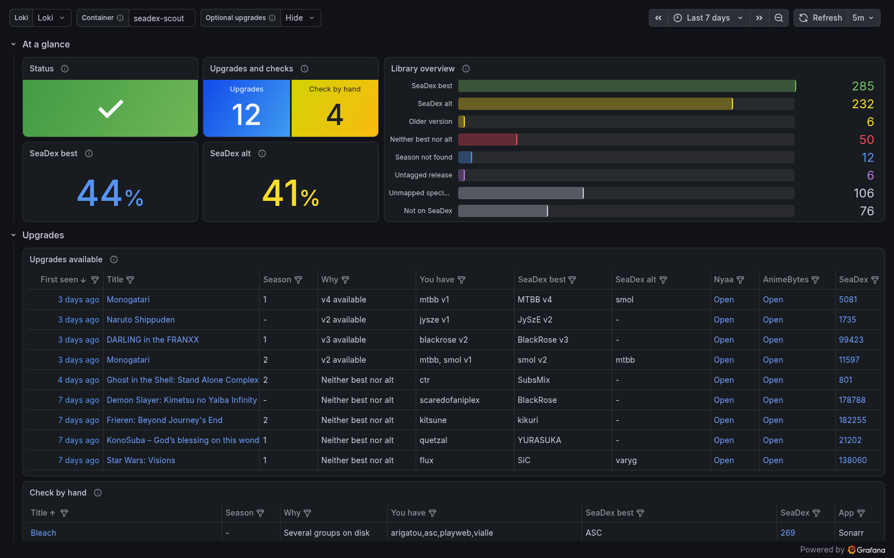

# seadex-scout

[](https://github.com/cplieger/seadex-scout/pkgs/container/seadex-scout) [](https://github.com/cplieger/seadex-scout/pkgs/container/seadex-scout) [](https://github.com/cplieger/seadex-scout/blob/main/Dockerfile) [](https://github.com/cplieger/seadex-scout/issues?q=label%3Agremlins-tracker) [](https://github.com/cplieger/seadex-scout/releases)

<!-- hub-overview BEGIN -->
seadex-scout keeps your Sonarr and Radarr anime library in sync with the best releases on [SeaDex](https://releases.moe), the community list of the best release for each show. It shows where a better release exists and leaves downloads to Sonarr and Radarr.



## What it does

seadex-scout helps you keep your anime library on SeaDex's recommended releases:

- Tells you when SeaDex lists a better release than yours, or a newer v2 or REPACK of it.
- Shows those upgrades, and how much of your library matches SeaDex, in Grafana.
- Writes an on-demand report comparing each season, film and special you have with SeaDex.
- Can offer SeaDex's picks to Sonarr and Radarr as an indexer, so they download them under your quality rules.

You can leave out remuxes, require dual audio, skip specials and add AnimeBytes releases.

## Who it is for

seadex-scout is built for people who keep an anime library in Sonarr or Radarr and want it on the releases SeaDex recommends. It compares the files you already have, one season, film or special at a time. Without it, you would open each show on releases.moe and compare its release groups with your files by hand.

You need a Sonarr instance, a Radarr instance or both, with anime in them. seadex-scout reports through its log, so its alerts come from your Loki and Alertmanager, and its dashboard from Grafana. The [monitoring guide](https://github.com/cplieger/docs/blob/main/docs/monitoring.md#the-smallest-stack-sends-notifications-only) sets them up. The optional indexer needs a Prowlarr instance with its Nyaa or AnimeBytes indexer.

seadex-scout is free software under the GPL-3.0-or-later license.
<!-- hub-overview END -->

## Quick start

The image is on GitHub Container Registry and Docker Hub, for `amd64` and `arm64`. This is the [`compose.yaml`](compose.yaml) in this repository.

```yaml
services:
  seadex-scout:
    image: ghcr.io/cplieger/seadex-scout:latest
    container_name: seadex-scout
    restart: unless-stopped
    # Create ./config and run "sudo chown 1000:1000 config" before the first start,
    # or the container restarts in a loop. If you set PUID and PGID in .env, use those numbers.
    user: "${PUID:-1000}:${PGID:-1000}"
    environment:
      - SONARR_URL  # from .env, the address you open Sonarr at, such as http://192.0.2.10:8989
      - SONARR_API_KEY  # from .env, found in Sonarr under Settings, General, API Key
      - RADARR_URL  # optional, set both RADARR_ lines in .env to add Radarr
      - RADARR_API_KEY
      - SEADEX_SCOUT_FEED_KEY  # these three are for the optional indexer, see docs/torznab-indexer.md
      - SEADEX_SCOUT_PROWLARR_KEY
      - SEADEX_SCOUT_AB_PASSKEY
    volumes:
      - "./config:/config"  # config.yaml, saved state and the reports folder
```

1. In the folder that holds `compose.yaml`, create the config folder: `mkdir config && sudo chown 1000:1000 config`. If your `.env` sets `PUID` and `PGID`, use those numbers instead of `1000`.
2. Create a file named `.env` beside `compose.yaml` with these two lines:

   ```sh
   SONARR_URL=http://192.0.2.10:8989
   SONARR_API_KEY=your-sonarr-api-key
   ```

   `SONARR_URL` is the address you open Sonarr at from another device on your network, not `localhost`. The API key is on Sonarr's Settings, General page. Add `RADARR_URL` and `RADARR_API_KEY` the same way to include Radarr.
3. Run `docker compose up -d`.
4. To get a message for each new upgrade, set up the [smallest monitoring stack](https://github.com/cplieger/docs/blob/main/docs/monitoring.md#the-smallest-stack-sends-notifications-only) and load seadex-scout's alert rules into it, as that page shows. This step is optional.

Run `docker logs seadex-scout`. You should see `sonarr reachable`. Findings then appear as `better release available` lines. If you see `sonarr ping failed at startup`, the address is wrong or Sonarr is down.

On Unraid, open the **Apps** tab, search for seadex-scout and click **Install**. Enter your Sonarr URL and API key, then start it.

## Reading the results

The Grafana dashboard each release ships, for Grafana 13.2 or newer, lists every upgrade newest first, with links to the release and the show in Sonarr or Radarr. It shows how much of your library is at SeaDex's best or alt, and whether the scout is healthy. [Monitoring and alerts](docs/monitoring.md#dashboard) shows how to import it.

With the rules from step 4 loaded, your Alertmanager sends each new upgrade to Discord, email or any receiver it supports, with a link to the release. To stop the messages for one show, add its `al_id` to `filters.ignore`.

For a full report, run this while the container is up:

```sh
docker exec seadex-scout /seadex-scout report
```

It writes a timestamped Markdown and JSON pair into `config/reports`, with a verdict for each season, film and special. [How seadex-scout works](docs/how-it-works.md#the-report) explains every verdict.

## Adding the indexer

The indexer is off until you set it up. It offers SeaDex's picks to Sonarr and Radarr as a Torznab indexer, marked so a Custom Format can score them. It finds releases by searching through the Nyaa and AnimeBytes indexers you already have in Prowlarr.

You fill in the `indexer` section of `config.yaml`, add port `9118` to the service, and add the feed to Sonarr and Radarr as a Torznab indexer. Then you create two Custom Formats, one for SeaDex's best picks and one for its alternatives. In that indexer's settings in Sonarr, tick **Anime Standard Format Search**. Without it, Sonarr asks only for single episodes, which the indexer does not answer, and you get nothing.

Right after setup, the indexer's RSS list is empty. It lists only picks SeaDex adds from then on. Sonarr and Radarr find the older ones when they search. [Torznab feed setup](docs/torznab-indexer.md) has every click.

## Configuration reference

Settings live in one file, `config/config.yaml`. The first start writes it from the annotated [`config.example.yaml`](config.example.yaml) with a generated `feed_api_key`. seadex-scout reads it once at start, so restart the container after an edit. A misspelled key stops the start with an error that names it, such as `unknown configuration key "anime_bytes"`.

The starter file reads the four connection settings below from the environment. Turn on at least Sonarr or Radarr. Any value in the file can name a `SONARR_*`, `RADARR_*` or `SEADEX_SCOUT_*` variable as `${VAR}`, so secrets can stay in `.env`.

| Variable | Description | Default |
| --- | --- | --- |
| `SONARR_URL` | Where seadex-scout reaches Sonarr. Unset turns Sonarr off. | _(unset)_ |
| `SONARR_API_KEY` | Sonarr's API key, needed when `SONARR_URL` is set. | _(unset)_ |
| `RADARR_URL` | Where seadex-scout reaches Radarr. Unset turns Radarr off. | _(unset)_ |
| `RADARR_API_KEY` | Radarr's API key, needed when `RADARR_URL` is set. | _(unset)_ |
| `CONFIG_PATH` | Path of the config file. | `/config/config.yaml` |

The settings most people change:

| Key | Default | Description |
| --- | --- | --- |
| `mode` | `daemon` | `daemon` runs on a schedule. `report` writes one report and exits. |
| `poll_interval` | `15m` | How often to check SeaDex for changes. Minimum `15m`. `off` hands scheduling to an outside tool. |
| `animebytes` | `false` | Set `true` when you have an AnimeBytes account, to include its releases and links. |
| `filters.exclude_remux` | `false` | Leave out releases classified as remux. |
| `filters.require_dual_audio` | `false` | Leave out releases that are not dual audio. |
| `filters.exclude_specials` | `false` | Leave out OVA, ONA and special entries. |
| `filters.ignore` | `[]` | AniList IDs of shows to stop warning about. They still appear in the report and the indexer. |
| `arr_tags.include` | `[]` | Check only items with one of these Sonarr or Radarr tags. `[]` checks everything. |
| `arr_tags.exclude` | `[]` | Never check items with one of these tags. An exclude wins over an include. |
| `sonarr.public_url` | _(unset)_ | The Sonarr address your browser uses, for links in the report. Empty reuses `sonarr.url`. |
| `report.dir` | `/config/reports` | Where each report pair is written. |
| `log.level` | `info` | `debug`, `info`, `warn` or `error`. The shipped alert rules need `info`. |

[Configuration](docs/configuration.md) lists every key, including the indexer settings and how to run checks from an outside scheduler.

| Mount | Description |
| --- | --- |
| `/config` | `config.yaml`, saved state, the indexer's `feed.json` and the `reports` folder. |

| Port | Description |
| --- | --- |
| `9118` | The optional indexer. Bound only when a Torznab URL is set. |

## Security

seadex-scout opens no port until you set up the indexer. The indexer then answers only requests that carry its `feed_api_key`, and refuses the rest with `401`.

Keep the indexer on your local network, because the AnimeBytes RSS links it serves contain your AnimeBytes passkey. If you write the passkey into `config.yaml` itself rather than `.env`, a backup of `config` carries it too.

seadex-scout never logs an API key, and sends the Prowlarr key in a request header rather than in a URL. The image runs as a non-root user on a distroless base, which has no shell. [Security](docs/hardening.md) has a hardened compose setup.

## Troubleshooting

The healthcheck runs `seadex-scout health`, which reads a marker file each completed check refreshes. Unhealthy means the last read of your Sonarr or Radarr library failed, or no check has finished in 3 hours. A `poll_interval` over 1 hour lengthens that wait. A SeaDex outage keeps the container healthy and keeps your existing findings.

- The container restarts in a loop at the first start. The `config` folder does not belong to the container user. Run the `chown` from the quick start.
- The log says `no config found; wrote a starter config, but it cannot start yet`. `SONARR_URL` or `SONARR_API_KEY` did not reach the container. Check `.env`, then restart.
- The log says `sonarr ping failed at startup`. Use Sonarr's network address, not `localhost`, and check that Sonarr is running.
- The indexer finds nothing on searches. Tick **Anime Standard Format Search** on the indexer in Sonarr.

## Monitoring

seadex-scout writes JSON logs to standard output and has no metrics endpoint. Nine Loki alert rules ship in [`alerts/logql.yaml`](alerts/logql.yaml), and a Grafana dashboard for Grafana 13.2 or newer ships with every release as `grafana-dashboard.json`. On Grafana 13.1 or older, take it from release [v2.12.1](https://github.com/cplieger/seadex-scout/releases/tag/v2.12.1), the last one in the older dashboard format, and maintain it yourself. [Monitoring and alerts](docs/monitoring.md) explains both and shows how to load them.

## Documentation

- [Torznab feed setup](docs/torznab-indexer.md) connects the indexer to Prowlarr, Sonarr and Radarr.
- [Configuration](docs/configuration.md) lists every setting and shows how to run checks from an outside scheduler.
- [How seadex-scout works](docs/how-it-works.md) explains matching, the report verdicts, release versions and the indexer.
- [Fixing a wrong or missing match](docs/fixing-a-mapping.md) shows how to correct one.
- [Monitoring and alerts](docs/monitoring.md) describes the log lines, health, dashboard and alert rules.
- [Security](docs/hardening.md) has a hardened compose setup and explains credential handling.

## Credits

- The anime ID map comes from [animap](https://github.com/cplieger/animap). `animap.json` is made available under the [Open Database License (ODbL) 1.0](https://opendatacommons.org/licenses/odbl/1-0/), and its contents under the [Database Contents License (DbCL) 1.0](https://opendatacommons.org/licenses/dbcl/1-0/). It contains information from [anime-offline-database](https://github.com/cedya77/anime-offline-database), made available under the ODbL 1.0 and the DbCL 1.0, from [Anime-Lists](https://github.com/Anime-Lists/anime-lists), and episode counts from [AniDB](https://anidb.net), read through [AnimeAggregations](https://github.com/notseteve/AnimeAggregations).
- The way seadex-scout compares the release groups in a Sonarr or Radarr anime library with SeaDex follows [seadexarr](https://github.com/bbtufty/seadexarr).
- The indexer reads a release's tracker ID from its page URL and accepts only an ID made of digits. Both rules follow [seadexerr](https://github.com/Ryder-C/seadexerr), a Prowlarr indexer for SeaDex releases.

## Contributing

Issues and pull requests are welcome. See [CONTRIBUTING.md](CONTRIBUTING.md).

## Disclaimer

This project is built with care and follows security best practices, but it is intended for personal / self-hosted use. No guarantees of fitness for production environments. Use at your own risk.

This project was built with AI-assisted tooling using [Claude](https://claude.com), [GPT](https://openai.com), and [Kiro](https://kiro.dev). The human maintainer defines architecture, supervises implementation, and makes all final decisions.

## License

GPL-3.0-or-later. Linking [`arrapi`](https://github.com/cplieger/arrapi) (GPL-3.0-or-later) makes seadex-scout GPL-3.0-or-later. See [LICENSE](LICENSE). The image carries the license text of every bundled component under `/usr/share/licenses/`.

Third-party attributions are in [THIRD_PARTY_NOTICES.md](THIRD_PARTY_NOTICES.md).
